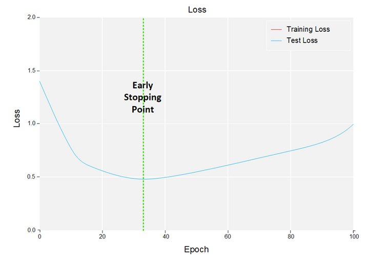

* any list
{:toc}
### 1.1 Overfitting

overfitting occurs when our model fits nearly perfectly to our training data, However, fitting to closely to test data isn't always a good thing. 

模型在训练集表现完美，但是在测试集中表现不好，我们就说模型过拟合了

Markdown Latex数学公式 <https://blog.csdn.net/fzch_struggling/article/details/44998901>

### 1.2 Types of Regularization

#### 1.2.1 L1&L2 Regularization 

L1&L2 regularization用来惩罚大的权重

L2正则化

$$Error = \frac{1}{2}\left( target - out\right)^2 + \frac{\lambda}{2}\sum{w}_{i}^2​$$

L1正则化

$$Error = \frac{1}{2}\left( target - out\right)^2 + \frac{\lambda}{2}\left|{w}_{i}\right|​$$

#### 1.2.2 Cross Validation   

#### 1.2.3 Early Stopping

#### 1.2.4 Drop out

#### 1.2.5 Dataset Augmentation 

