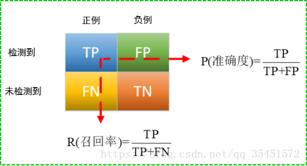
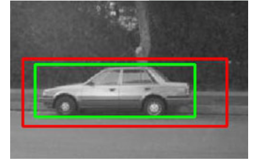
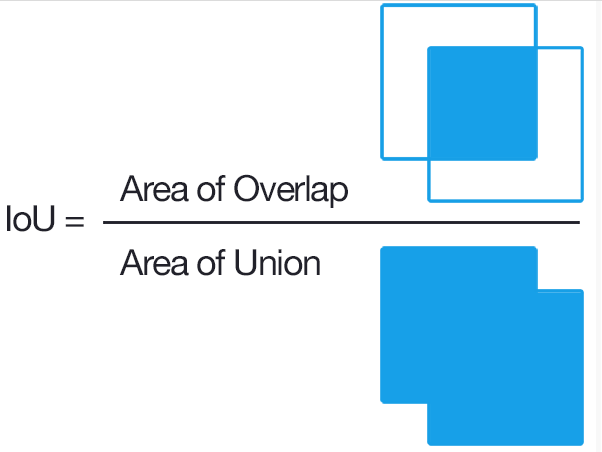
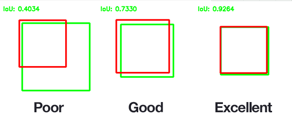

* any list
{:toc}
### 1. 精度mAP

#### 1.1 混淆矩阵

我们首先好好解读一下混淆矩阵里的一些名词和其意思。根据混淆矩阵我们可以得到TP,FN,FP,TN四个值，显然TP+FP+TN+FN=样本总数。这四个值中都带两个字母，单纯记忆这四种情况很难记得牢，我们可以这样理解：第一个字母表示本次预测的正确性，T就是正确，F就是错误；第二个字母则表示由分类器预测的类别，P代表预测为正例，N代表预测为反例。比如TP我们就可以理解为分类器预测为正例（P），而且这次预测是对的（T），FN可以理解为分类器的预测是反例（N），而且这次预测是错误的（F），正确结果是正例，即一个正样本被错误预测为负样本。

| 符号                   | 含义                                       |
| ---------------------- | ------------------------------------------ |
| **TP**(true positive)  | 分类器预测为正例，预测是正确的，实际是正例 |
| **FP**(false positive) | 分类器预测为正例，预测是错误的，实际为负例 |
| **TN**(true negative)  | 分类器预测为负例，预测是正确的，实际为负例 |
| **FN**(false negative) | 分类器预测为负例，预测是错误的，实际为正例 |

#### 1.2  Precision、Recall、PRC、F1-score

Precision指标在中文里可以称为查准率或者是精确率，Recall指标在中卫里常被称为查全率或者是召回率，查准率 P和查全率 R分别定义为：

查准率P和查全率R的具体含义如下：

- 查准率(Precision）是指在所有系统判定的“真”的样本中，确实是真的的占比
- 查全率（Recall）是指在所有确实为真的样本中，被判为的“真”的占比

这里想强调一点，precision和accuracy（正确率）不一样的，accuracy针对所有样本，precision针对部分样本，即正确的预测/总的正反例：

### 2. 速度 fps

目标检测算法的另外一个重要性能指标是速度，只有速度快，才能实现实时检测，这对一些应用场景极其重要。评估速度的常用指标是**每秒帧率（Frame Per Second，FPS），即每秒内可以处理的图片数量**。

### 3. 准确性 IOU

IOU（Intersection over Union），中文翻译为交并比。

这里是一个实际例子：下图绿色框是真实感兴趣区域，红色框是预测区域，这种情况下交集确实是最大的，但是红色框并不能准确预测物体位置。因为预测区域总是试图覆盖目标物体而不是正好预测物体位置。这时如果我们能除以一个并集的大小，就可以规避这种问题。这就是IOU要解决的问题了。

下图表示了IOU的具体意义，即：预测框与标注框的交集与并集之比，数值越大表示该检测器的性能越好。

使用IOU评价指标后，上面提到的问题一下子解决了：我们控制并集不要让并集太大，对准确预测是有益的，这就有效抑制了“一味地追求交集最大”的情况的发生。下图的2,3小图就是目标检测效果比较好的情况。

